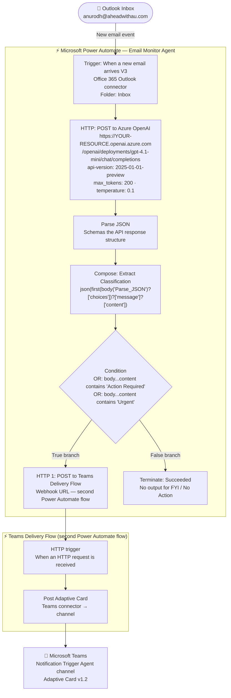

# Architecture

## System Overview

This agent is a fully autonomous, event-driven system built on two Microsoft Power Automate cloud flows. It has no browser interface, no hosted server, and no manual trigger — it fires on every new email arriving in an Outlook inbox and delivers structured AI analysis to Microsoft Teams.



---

## Components

| Component | Role | Technology |
|---|---|---|
| Outlook trigger | Fires on every new inbox email | Power Automate — Office 365 Outlook connector |
| HTTP step | Sends email content to GPT-4.1-mini for classification | Power Automate HTTP action → Azure OpenAI API |
| GPT-4.1-mini | Classifies email into 4 categories, returns structured JSON | Azure AI Foundry — gpt-4.1-mini deployment |
| Parse JSON | Schemas and types the Azure OpenAI API response for downstream steps | Power Automate — Parse JSON action |
| Extract Classification | Parses the JSON string returned by GPT into a typed object | Power Automate — Compose action |
| Condition | Routes flow based on classification value | Power Automate — Condition action |
| HTTP 1 (True branch) | Calls the Teams Delivery Flow via its HTTP trigger URL | Power Automate HTTP action → Teams Delivery Flow webhook |
| Teams Delivery Flow | Receives the card payload and posts it to the Teams channel | Second Power Automate flow — HTTP trigger + Teams connector action |
| Terminate (False branch) | Ends flow cleanly for low-priority emails | Power Automate — Terminate action |
| Microsoft Teams | Receives and displays the Adaptive Card alert | Microsoft Teams — Workflows webhook |

---

## Data Flow

```
1. New email arrives in Outlook inbox (anurodh@aheadwithau.com)
2. Power Automate trigger fires immediately
3. HTTP action POSTs to Azure OpenAI:
   - System prompt: classify into Urgent / Action Required / FYI / No Action
   - User message: "From: {from} Subject: {subject} Body: {body}"
   - Model returns: {"classification": "...", "reason": "...", "suggested_action": "..."}
4. Parse JSON schemas and types the API response structure
5. Compose step parses choices[0].message.content JSON string into a typed object
6. Condition checks if body('HTTP')?['choices']?[0]?['message']?['content'] contains "Action Required" OR "Urgent"
   - True  → HTTP POST to Teams Delivery Flow (second Power Automate flow) with the Adaptive Card payload
   - False → Terminate (no output, no noise)
7. Teams Delivery Flow receives the payload via its HTTP trigger and posts the Adaptive Card to the channel
8. Teams displays Adaptive Card with:
   - Title: "📧 Email Alert — ACTION REQUIRED"
   - From, Subject, Classification, Reason, Suggested Action
```

---

## System Prompt

```
You are an email classifier for a business professional. Classify the email into exactly
one category: Urgent, Action Required, FYI, or No Action. Respond with only a JSON object
in this exact format:
{
  "classification": "CATEGORY",
  "reason": "one sentence explanation",
  "suggested_action": "what the recipient should do"
}
```

---

## Teams Adaptive Card Schema

```json
{
  "type": "message",
  "attachments": [{
    "contentType": "application/vnd.microsoft.card.adaptive",
    "content": {
      "type": "AdaptiveCard",
      "$schema": "http://adaptivecards.io/schemas/adaptive-card.json",
      "version": "1.2",
      "body": [
        {
          "type": "TextBlock",
          "text": "📧 Email Alert — ACTION REQUIRED",
          "weight": "Bolder",
          "size": "Medium",
          "color": "Attention"
        },
        {
          "type": "FactSet",
          "facts": [
            { "title": "From",             "value": "<dynamic: trigger From>" },
            { "title": "Subject",          "value": "<dynamic: trigger Subject>" },
            { "title": "Classification",   "value": "<dynamic: json(body)['classification']>" },
            { "title": "Reason",           "value": "<dynamic: json(body)['reason']>" },
            { "title": "Suggested Action", "value": "<dynamic: json(body)['suggested_action']>" }
          ]
        }
      ]
    }
  }]
}
```

---

## Infrastructure

| Resource | Name | Region | Plan |
|---|---|---|---|
| Azure AI Foundry Project | l-and-d-02 | East US 2 | — |
| Azure OpenAI resource | l-and-d-02-resource | East US 2 | — |
| Model deployment | gpt-4.1-mini (version 2025-04-14) | East US 2 | Global Standard |
| Power Automate flow (main) | Email Monitor Agent | Default environment | Microsoft 365 plan |
| Power Automate flow (delivery) | Teams Delivery Flow | Default environment | Microsoft 365 plan |
| Outlook mailbox | anurodh@aheadwithau.com | — | Microsoft 365 Business Premium |
| Teams channel | Notification Trigger Agent (Ahead with Anurodh team) | — | Microsoft 365 |

---

## Key Design Decisions

### 1. Power Automate over a custom listener
A custom email listener would require OAuth 2.0 against Microsoft Graph, persistent polling or webhook registration, and a hosted server. Power Automate's Outlook connector handles all of this natively. The trade-off is less flexibility but dramatically faster build time and zero infrastructure overhead.

### 2. Raw HTTP action over the native Azure OpenAI connector
Power Automate's built-in Azure OpenAI connector targets an older API version that does not include GPT-4.1-mini (launched April 2025). Using the raw HTTP action with `api-version=2025-01-01-preview` gives full control over model selection, prompt structure, and parameters.

### 3. Condition checks `body('HTTP')?['choices']?[0]?['message']?['content']` not `outputs('Extract_Classification')`
The condition step checks `body('HTTP')?['choices']?[0]?['message']?['content'] contains "Action Required"` rather than parsing the extracted classification object. This is more robust — the HTTP response body path is guaranteed to resolve at the condition evaluation point, whereas the Compose output can fail to evaluate in certain flow execution paths.

### 4. Terminate on False branch (not an empty branch)
Leaving the False branch empty causes Power Automate to mark low-priority runs as "Succeeded with warnings." Using an explicit Terminate action with Status = Succeeded produces clean run history and makes it clear the flow completed intentionally, not by falling through.
