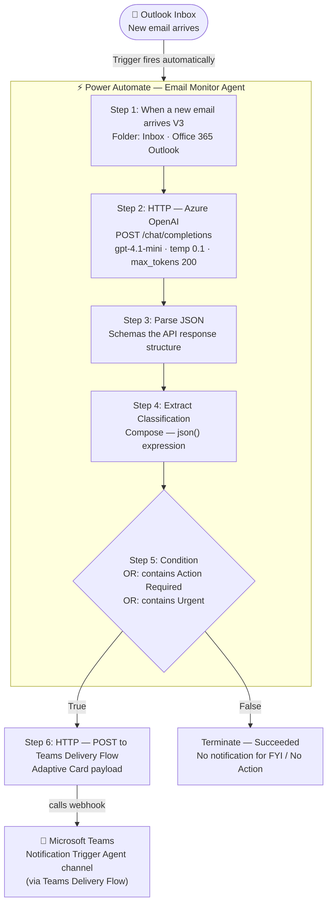
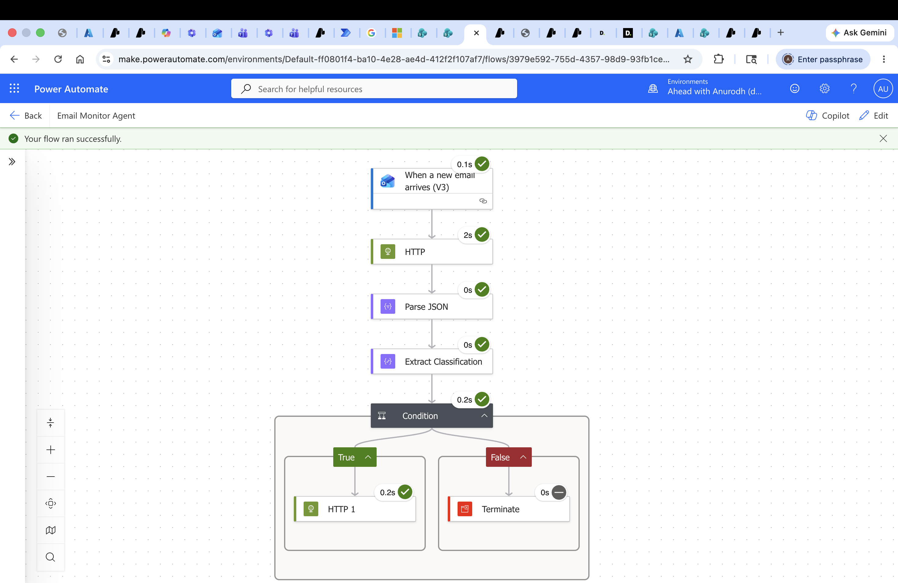
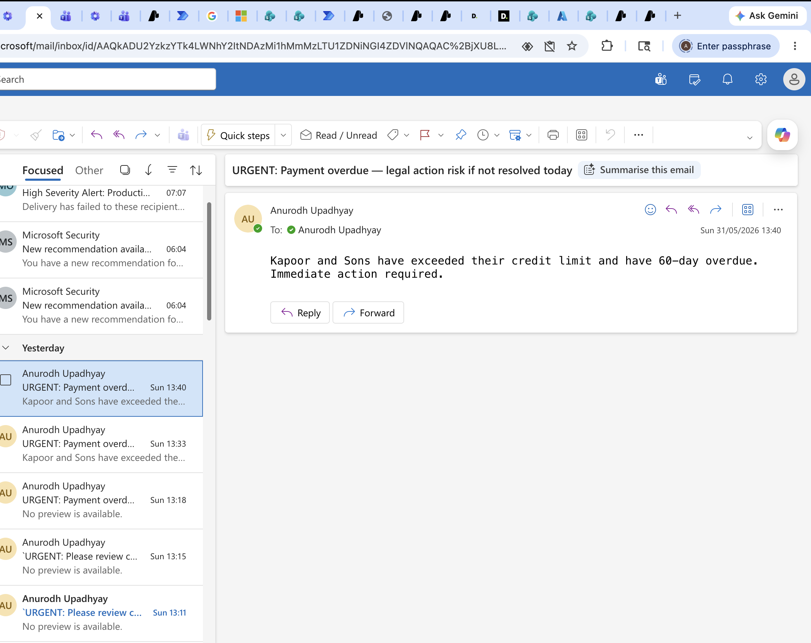
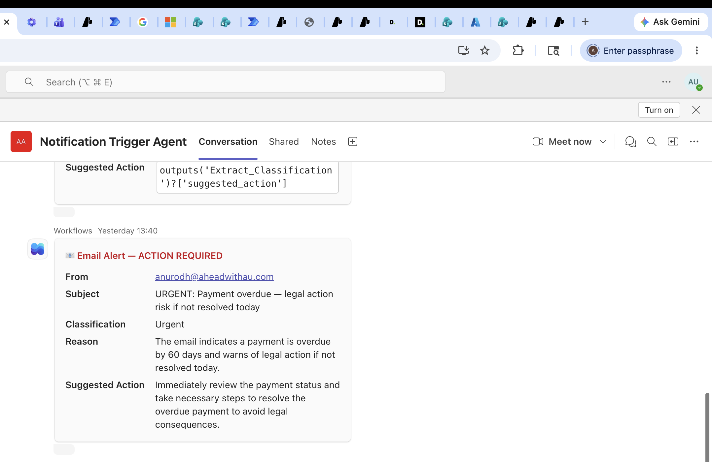

# AI Autonomous Email Monitor Agent

> A fully autonomous email monitoring agent built on Power Automate and Azure OpenAI that classifies every incoming email in real time and pushes a formatted Teams alert for anything urgent — without any human trigger.


---

## Live Flow

This agent is **live and running autonomously** on Microsoft Power Automate (cloud flow). It processes every new email arriving in the connected Outlook inbox in real time.

- **Platform:** Microsoft Power Automate — cloud-hosted, event-driven
- **Trigger:** Every new email in Outlook inbox fires the flow automatically
- **Last confirmed active:** June 2026

> There is no public web URL for this agent — it runs inside a Microsoft 365 tenant and delivers output directly to a Teams channel. Screenshots of a live run are in the [Demo](#demo) section.

---

## Problem

A business professional receives dozens of emails a day. Manually reading, triaging, and deciding what needs immediate action vs. what can wait is slow, error-prone, and cognitively expensive. Critical emails get buried. The cost of a missed urgent email can be high.

---

## Solution

Built a fully autonomous email monitoring agent using **Power Automate** and **Azure OpenAI (GPT-4.1-mini)**. The agent:

1. **Triggers automatically** on every new Outlook email — no button to press
2. **Classifies the email** using GPT-4.1-mini into: `Urgent`, `Action Required`, `FYI`, or `No Action`
3. **Generates a reason** and a suggested action in structured JSON
4. **Routes high-priority emails** (Urgent / Action Required) to Microsoft Teams as a formatted Adaptive Card
5. **Silently terminates** for low-priority emails (FYI / No Action) — no noise

The agent runs entirely in the cloud. Once configured, it operates 24/7 with no maintenance.

---

## Architecture



> **Two-flow architecture:** The Email Monitor Agent is one Power Automate flow. Teams delivery is handled by a second flow (HTTP trigger → Post Adaptive Card to Teams channel). The Email Monitor Agent calls that second flow's trigger URL in its True branch. Both flows run in the same Microsoft 365 tenant.

See [ARCHITECTURE.md](./ARCHITECTURE.md) for full component breakdown and design decisions.

---

## Tech Stack

| Layer | Technology |
|---|---|
| Automation platform | Microsoft Power Automate (cloud flow) |
| Trigger | Office 365 Outlook — "When a new email arrives (V3)" |
| AI inference | Azure OpenAI — GPT-4.1-mini via HTTP action |
| AI project | Azure AI Foundry — l-and-d-02 (East US 2) |
| Output channel | Microsoft Teams — Adaptive Card via webhook |
| Card format | AdaptiveCard v1.2 — FactSet layout |

---

## Development Tools

Built using [Claude Code](https://claude.ai/code) (Anthropic) for agentic development assistance.

---

## Features

- **Fully autonomous** — triggers on every new email, no human action required
- **Four-category classification** — Urgent / Action Required / FYI / No Action
- **Structured JSON output** — classification, reason, and suggested action in every response
- **Teams Adaptive Card** — formatted alert with sender, subject, classification, reason, and next step
- **Silent on low-priority** — no Teams noise for FYI or No Action emails
- **Event-driven architecture** — pure cloud, no server or polling required
- **Temperature 0.1** — near-deterministic classification, consistent results

---

## Getting Started

### Prerequisites

- Microsoft 365 account with Power Automate access (Business Basic or higher — free personal accounts do not include Power Automate cloud flows)
- Azure subscription with Azure AI Foundry
- GPT-4.1-mini deployed in Azure AI Foundry (or any GPT-4 variant)
- A second Power Automate flow with an HTTP Request trigger that posts Adaptive Cards to a Teams channel — its trigger URL becomes the `TEAMS_WEBHOOK_URL` (see [docs/build-guide.md](./docs/build-guide.md) Step 0)

> **Trying this with your own email:** There is no hosted version to fork. The build guide in [`docs/build-guide.md`](./docs/build-guide.md) is the complete try-it path — you will be recreating the flow inside your own Microsoft 365 tenant and Azure subscription, pointing it at any Outlook inbox you own. The flow is tenant-bound; it cannot be exported and imported as-is.

### How to Rebuild This Flow

Follow the step-by-step guide in [docs/build-guide.md](./docs/build-guide.md).

The guide covers:
- Setting up the Teams Delivery Flow (the reusable webhook that posts cards to Teams)
- Creating the automated cloud flow with the Outlook trigger
- Configuring the HTTP action to call Azure OpenAI
- Parsing the JSON response and extracting the classification
- Setting up the condition and Teams Adaptive Card

### Configuration Values You Will Need

```
AZURE_OPENAI_ENDPOINT   = https://YOUR-RESOURCE.openai.azure.com/openai/deployments/gpt-4.1-mini/chat/completions?api-version=2025-01-01-preview
AZURE_OPENAI_API_KEY    = YOUR_API_KEY
TEAMS_WEBHOOK_URL       = YOUR_POWER_AUTOMATE_WEBHOOK_URL
```

> These values live inside the Power Automate flow steps — there is no config file to edit locally. Substitute your own values when following the build guide.

---

## Demo

### Power Automate flow — all steps configured



### Source email that triggered the flow



### Teams Adaptive Card alert — live output



---

## Key Decisions & Tradeoffs

**Power Automate over a custom server**
Power Automate's Outlook connector handles authentication, polling, and trigger management natively. Building a custom email listener would require OAuth 2.0, IMAP polling, and a hosted server. Power Automate eliminates all of that — the flow runs in Microsoft's cloud with zero infrastructure to manage.

**HTTP action over the native Azure OpenAI connector**
Power Automate has an Azure OpenAI connector, but it uses an older API version that does not support GPT-4.1-mini (released April 2025). Using the raw HTTP action with `api-version=2025-01-01-preview` gives direct control over model, version, and prompt structure.

**Condition uses `body() contains` rather than exact expression match**
Initial implementation used `outputs('Extract_Classification')?['classification']` equals `Urgent`. This failed because the expression evaluated before the Compose step resolved in some run paths. The fix was to use `body('HTTP')?['choices']?[0]?['message']?['content'] contains "Action Required"` — checking the extracted content string directly, which is always available at that point in the flow.

**Temperature 0.1 for classification stability**
Email classification is a deterministic task — the same email should always get the same category. Temperature 0.1 suppresses creative variation and produces consistent outputs across repeated runs.

---

## Lessons Learned

1. **Power Automate folder picker vs. typed folder name.** The Outlook trigger's Folder field must use the folder picker UI — it resolves to an internal Exchange folder ID. Typing `Inbox` as plain text causes a 404 at runtime.

2. **API version matters for model availability.** `api-version=2024-02-15-preview` predates GPT-4.1-mini (April 2025 release) and returns a 404. Always use `2025-01-01-preview` or later for this model.

3. **Backtick characters break the Azure OpenAI HTTP headers.** Header names copied from markdown docs may carry backtick characters. These cause 401 Unauthorized on the Azure OpenAI HTTP step specifically. Delete and re-enter the `Content-Type` and `api-key` header rows manually by typing directly.

4. **Markdown code fences in the Body field cause 400 BadRequest.** The HTTP action body must be raw JSON — no ` ```json ` opening or ` ``` ` closing. The body field is not a markdown renderer.

5. **Expression timing in Condition steps.** Complex expressions referencing Compose step outputs can fail if the expression is evaluated before the Compose resolves. Simplify by checking a direct path within the HTTP response (`body('HTTP')?['choices']?[0]?['message']?['content']`) rather than routing through the Compose output.

---

## Status

**Active** — v1.0.0 complete. Flow is running live. Possible next iteration: add a Logic Apps branch to send a reply email or create a calendar reminder for Urgent items.

---

## Author

**Anurodh Upadhyay**
[LinkedIn](https://www.linkedin.com/in/anurodh-upadhyay-49115146/) · [upadhyayanurodh@gmail.com](mailto:upadhyayanurodh@gmail.com)
